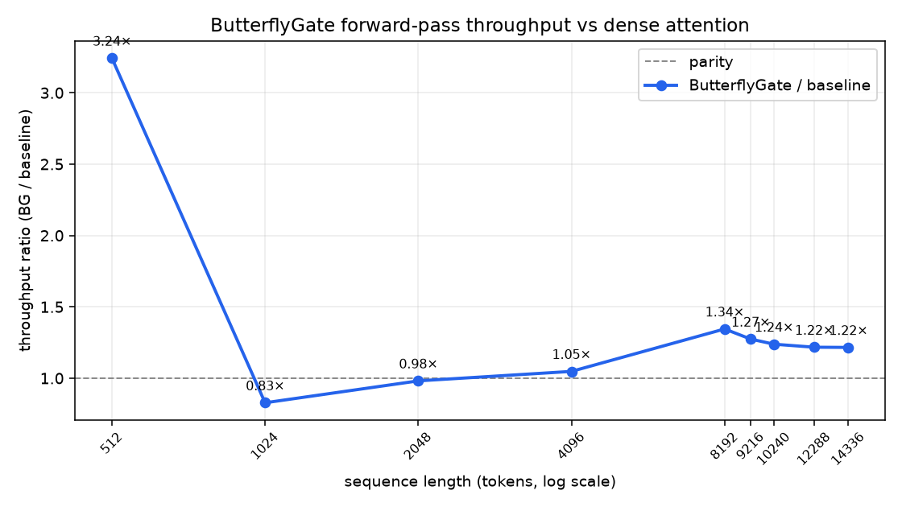

# butterflygate

[](https://github.com/kanishkpaul/butterflygate/actions/workflows/ci.yml)
[](LICENSE)

**A sub-quadratic, hardware-parallel replacement for transformer self-attention,
and a benchmark of where it is faster and where it isn't.**

> Part of a research series — see also
> [arc-agi3-world-models](https://github.com/kanishkpaul/arc-agi3-world-models) and
> [resonatorlm-audit](https://github.com/kanishkpaul/resonatorlm-audit) ·
> write-ups at [kanishkpaul.com/research](https://kanishkpaul.com/research)



ButterflyGate replaces dense O(n²) self-attention with a **structured
token-mixing network** whose cost grows as **O(n log n)**. This page reports a
forward-only throughput benchmark on **real weights**
(`google/gemma-4-E2B-it` and `meta-llama/Llama-3.2-1B`) over Dolma text.

> **Status: mechanism held back pending write-up.** This is a **results
> preview**. The exchange structure, gate parametrization, and training recipe
> are not published here. What's shown is the measured efficiency and its
> limits.
>
> **Scope: read this first.** These are **speed** measurements of an
> **untrained** gate dropped into the early layers of pretrained models, forward
> pass only. Next-token accuracy of the modified path collapses because the gate
> was never trained. The result here is throughput, not modeling quality.

---

## Results

Throughput is tokens per second for one forward pass at batch size 1, `bf16`.
BG is the hybrid model with ButterflyGate in its early layers; baseline is the
unmodified model.

**gemma-4-E2B-it**, through 14,336 tokens (16,384 ran out of VRAM):

| seq_len | baseline tok/s | BG tok/s | BG / baseline |
|--------:|---------------:|---------:|--------------:|
| 512     | 2,358.9  | 7,648.5  | 3.24× ⚠️ |
| 1024    | 13,094.7 | 10,839.3 | 0.83× |
| 2048    | 11,626.3 | 11,407.3 | 0.98× |
| 4096    | 8,687.4  | 9,100.9  | 1.05× |
| 8192    | 4,261.6  | 5,731.7  | 1.35× |
| 12288   | 3,398.4  | 4,136.1  | 1.22× |
| 14336   | 3,115.8  | 3,787.8  | 1.22× |

**Llama-3.2-1B**, through 32,768 tokens (65,536 failed before timing):

| seq_len | baseline tok/s | BG tok/s | BG / baseline |
|--------:|---------------:|---------:|--------------:|
| 512     | 1,196.3  | 4,237.4  | 3.54× |
| 2048    | 5,023.9  | 14,137.0 | 2.81× |
| 8192    | 13,553.0 | 25,828.5 | 1.91× |
| 16384   | 19,603.5 | 26,281.8 | 1.34× |
| 32768   | 21,947.7 | 25,149.1 | 1.15× |

Full rows, including 1024, 4096, 9216, and 10240, are in [`results/`](results/).

## Reading the numbers

**What holds up.** From 4,096 tokens on, the hybrid is faster on Gemma at every
length it could run, settling around 1.2×. On Llama it is faster at every
length measured.

**Don't trust the 512-token Gemma row.** Baseline throughput jumps 5.5× from
512 to 1,024 tokens (2,359 → 13,095 tok/s), then falls steadily at every
longer length. That jump is out of line with the rest of the curve, and the cause is in the
runner: there were no warmup passes and baseline always ran first, so the
512-token baseline was the first timed pass of the whole run and paid CUDA
start-up costs. Treat the 3.24× as unreliable until it's rerun with warmup
(see [methodology](docs/methodology.md)).

**The advantage does not widen with length.** On Llama the ratio falls from
3.54× to 1.15× as context grows. On Gemma it peaks at 1.35× (8,192) and settles
at 1.22×. Two things explain this:

1. Only the early layers are replaced. The rest of the model is still
   quadratic, so at long context the whole-model speedup is capped by the share
   of time spent in the replaced layers. It should plateau, and it does.
2. At batch size 1, short sequences leave the GPU underused. Baseline Llama
   throughput *rises* 18× from 512 to 32,768 tokens, so the short-sequence
   ratios measure overhead as much as mixing cost.

The asymptotic O(n log n) vs O(n²) argument applies to the replaced layers,
not to the hybrid model as a whole. The next experiment that would test the
scaling claim directly is replacing every layer, or timing a single mixing
block in isolation, and training the gate so accuracy stops collapsing.

## Benchmark harness

[`benchmark/bench_forward.py`](benchmark/bench_forward.py) times the forward
pass of *any* token-mixing `nn.Module` across a sequence-length sweep, with
warmup, `bf16`, and peak-VRAM tracking. It knows nothing about ButterflyGate:
you hand it a module factory and it reports tokens per second.

```bash
python benchmark/bench_forward.py --factory my_pkg.mixers:make_block --lengths 512 1024 2048 4096
```

The harness times one block on random activations. The results above came from
full-model hybrid runs on real weights and text; that runner is not included.

**On a Mac** the harness runs, but it has no Apple Silicon (MPS) path: with no
CUDA device it falls back to CPU, which is slow in `bf16` (a stock
`nn.MultiheadAttention` block manages about 1,400 tok/s at 512 tokens on an
M5). Use it for correctness checks there, not timing.

Regenerate the figure from the shipped timings with no GPU:

```bash
pip install matplotlib
python plots/plot_crossover.py results/gemma4_e2b_crossover.csv plots/crossover.png
```

Methodology (protocol, models, limit procedure, caveats):
[`docs/methodology.md`](docs/methodology.md).

## What's public vs. withheld

| Public here | Withheld until publication |
|---|---|
| The timing CSVs and the crossover figure | The exchange architecture and gate parametrization |
| The mechanism-agnostic benchmark harness | The ButterflyGate `nn.Module` itself |
| Methodology and the untrained-gate caveat | The training recipe, full-model runner, and raw logs |

If you're evaluating this for a role, I'm glad to walk through the full method
and numbers directly.

## Author

Kanishk Paul — [kanishkpaul.com](https://kanishkpaul.com) ·
[github.com/kanishkpaul](https://github.com/kanishkpaul)
